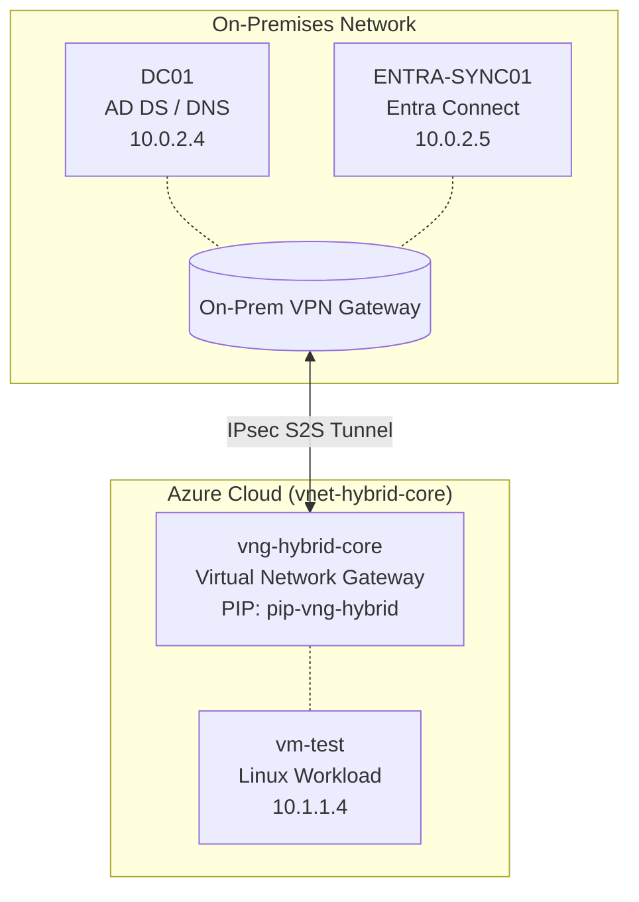

# Azure Hybrid Active Directory Infrastructure Lab

## Overview
This repository contains the architecture and configuration documentation for a hybrid Active Directory environment. The infrastructure bridges an on-premises network with an Azure Virtual Network (VNet) via a Site-to-Site (S2S) IPsec VPN tunnel. This enables secure cross-premises DNS resolution, domain-joined workloads, and identity synchronization via Microsoft Entra Connect.

## Network Topology

## IP Address Management (IPAM)

### On-Premises
| Hostname | Role | IP Address |
| :--- | :--- | :--- |
| **DC01** | Primary Domain Controller & DNS | `10.0.2.4` |
| **ENTRA-SYNC01** | Microsoft Entra Connect Sync Server | `10.0.2.5` |

### Azure (VNet)
| Resource / Hostname | Role | IP / Subnet |
| :--- | :--- | :--- |
| **vng-hybrid-core** | Virtual Network Gateway | `pip-vng-hybrid` / `GatewaySubnet` |
| **vm-test** | Domain-Joined Workload (Linux) | `10.1.1.4` |

## Project Milestones & Validation Evidence
*(Insert screenshots below as the deployment progresses)*

### 1. Tunnel Health & Layer 3 Routing
- [x] **S2S VPN Established:** Bidirectional IPsec tunnel operational.
- [x] **Routing Validated:** Direct SSH over the private tunnel successful from on-premises to `10.1.1.4`.

### 2. Name Resolution
- [ ] **Cross-Premises DNS:** `vm-test` successfully resolving the domain via `10.0.2.4`.

### 3. Domain Integration
- [ ] **AD Object Created:** `vm-test` successfully joined to the domain.

### 4. Entra Connect Deployment
- [ ] **Identity Synchronization:** `ENTRA-SYNC01` exporting local AD objects to Azure AD.

---
**Troubleshooting Notes:** 
*   **Bastion Bypass:** During initial configuration, the Azure Bastion Developer SKU experienced a regional DNS resolution failure (`NODATA` response from Traffic Manager). Management operations were successfully rerouted through the Site-to-Site VPN as a fallback.
