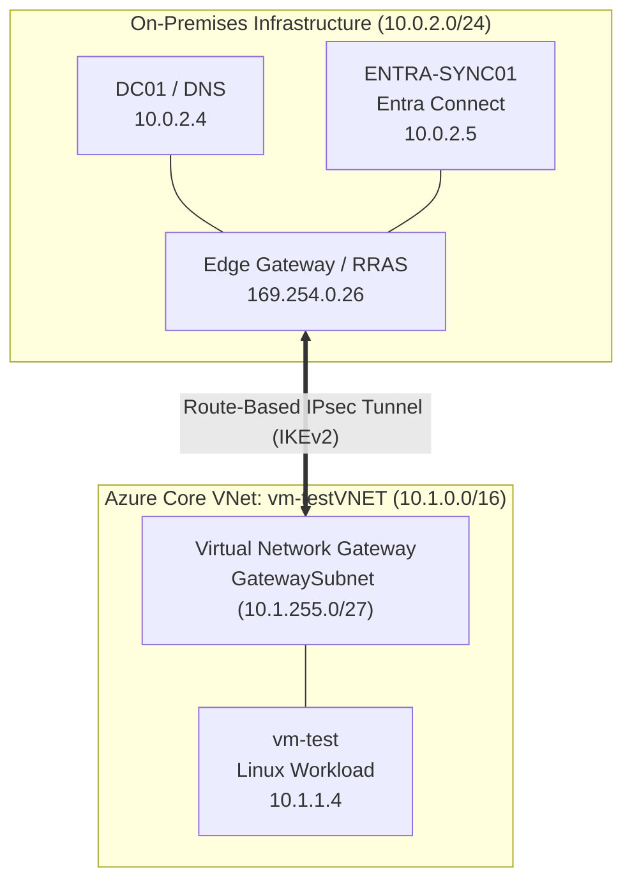

# Cross-Premises IPsec S2S Transit, DNS Resolution & Hybrid Join Validation

## Executive Summary
This directory contains end-to-end architectural and operational validation of a route-based IPsec Site-to-Site (S2S) VPN tunnel connecting an on-premises Active Directory environment (`hybrid.lan`) to an Azure Virtual Network (`10.1.0.0/16`). It demonstrates secure cross-boundary Layer 3 routing, stateful directory service port reachability, hybrid name resolution, Linux domain integration, and Windows Hybrid Entra Join synchronization.

---

## 1. Architecture & IPAM Topology

### Network Topology

### IP Address Management (IPAM)
| Hostname / Node | Role | Subnet / Interface | IP Address |
|---|---|---|---|
| **`DC01`** | Primary Domain Controller & DNS | `10.0.2.0/24` | `10.0.2.4` |
| **`ENTRA-SYNC01`** | Entra Connect Sync Engine | `10.0.2.0/24` | `10.0.2.5` |
| **`Azure-S2S-VPN`** | On-Premises Tunnel Interface | APIPA Point-to-Point | `169.254.0.26` |
| **`vng-hybrid-core`** | Azure Virtual Network Gateway | `GatewaySubnet` (`10.1.255.0/27`) | Dynamic Private / Public IP |
| **`vm-test`** | Hybrid Domain-Joined Linux Node | Workload Subnet (`10.1.1.0/24`) | `10.1.1.4` |

---

## 2. Evidence Chain of Custody

| Step | Source System | Evidence File / Artifact | Key Findings |
|---|---|---|---|
| **01. S2S Tunnel State** | Azure Portal / VNG | [vpn-gateway-status](./vpn-gateway-status.jpg) | Confirmed active S2S connection status (`Connected`) with bidirectional telemetry across the gateway plane. |
| **02. Layer 3 Routing** | `DC01` | [tracert-to-azure-vm](./tracert-to-azure-vm.txt) | Executed `tracert 10.1.1.4`; verified packet egress over the S2S interface to the Azure workload subnet without routing loops. |
| **03. Private Remote Access** | Workstation / VPN | [ssh-session-vm-test](./ssh-session-vm-test.jpg) | Established direct interactive SSH management session to `vm-test` (`10.1.1.4`) over the private encrypted tunnel. |
| **04. Cross-Premises DNS** | `vm-test` (`10.1.1.4`) | [dig-hybrid-lan](./dig-hybrid-lan.jpg) | Executed `dig @10.0.2.4 hybrid.lan +short`; confirmed cloud-to-on-premises DNS resolution of the local domain. |
| **05. AD Port Validation** | `vm-test` (`10.1.1.4`) | [nc-ad-ports-check](./nc-ad-ports-check.jpg) | Executed `nc -zv 10.0.2.4 389` (LDAP) and `88` (Kerberos); verified network paths and security list rules allow core directory traffic. |
| **06. Domain Machine Account** | `DC01` (ADUC) | [aduc-vm-test-object](./aduc-vm-test-object.jpg) / [aduc-vm-test-object1](./aduc-vm-test-object1.jpg) | Verified provisioned `vm-test` computer object inside target Active Directory OU (`OU=Computers,OU=Synced_Objects`). |
| **07. Sync Scope Filtering** | `ENTRA-SYNC01` | [SSM-EXPORT](./SSM-EXPORT.JPG) | Synchronization Service Manager demonstrates non-Windows Linux computer object staging and default Entra Connect OS filtering. |
| **08. Hybrid Join Lifecycle** | Entra Admin Center / Sync | [entra-hybrid-join-status](./entra-hybrid-join-status.jpg) / [winvm-sync-import](./winvm-sync-import.jpg) | Verified synchronization and successful registration of hybrid domain-joined Windows production devices in Microsoft Entra ID. |

---

## 3. Deep-Dive Technical Analysis

### Tunnel Mechanics & Layer 3 Routing
* **Route-Based IPsec Transit:** Tunnel negotiation leverages IKEv2 with static host routes injected on `DC01` (`route -p add 10.1.0.0/16 if 26`), directing Azure-destined packets into the RRAS tunnel interface.
* **Out-of-Band Bastion Workaround:** When Azure Bastion (Developer SKU) experienced regional DNS resolution drops during staging, the private Site-to-Site VPN provided immediate out-of-band SSH/RDP management reachability directly over private IP space.

### Identity Boundary Integration
* **Kerberos & Name Resolution:** Linux workload integration requires bidirectional DNS translation and open Layer-4 paths for Kerberos ticket issuance (`TCP/UDP 88`) and LDAP directory lookups (`TCP/UDP 389`).
* **Entra Filtering:** Entra Connect evaluates incoming computer objects. Standard Windows endpoints complete registration via Hybrid Entra Join, whereas non-native workloads (`vm-test`) are filtered or managed via private directory boundaries to prevent tenant staging clutter.
