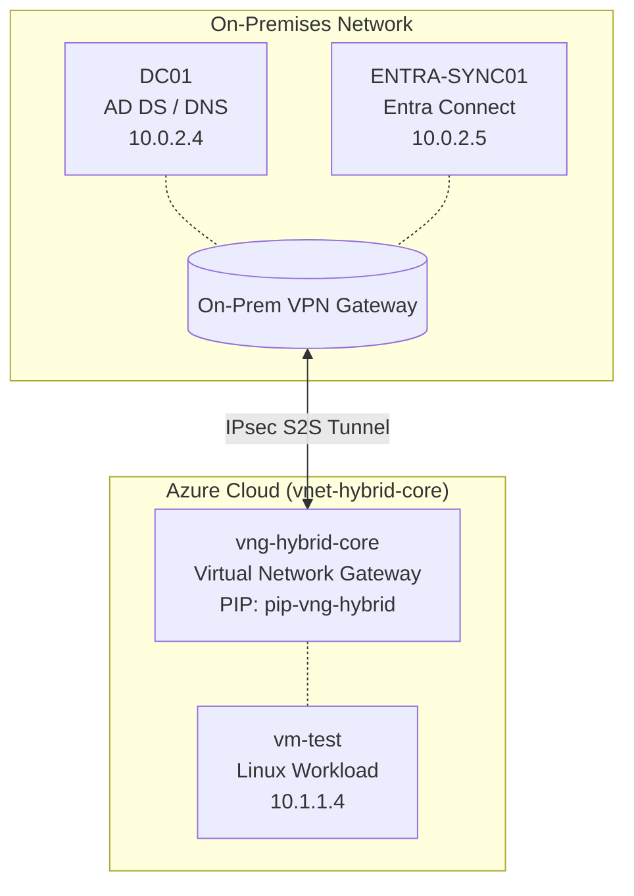

# Azure Hybrid Active Directory Infrastructure Lab

## Overview
This repository contains the architecture and validation evidence for a hybrid Active Directory environment. The infrastructure bridges an on-premises network with an Azure Virtual Network (VNet) via a Site-to-Site (S2S) IPsec VPN tunnel. This enables secure cross-premises DNS resolution, domain-joined workloads, and identity synchronization via Microsoft Entra Connect.

## 1. Architecture & Topology

### Network Diagram

### IP Address Management (IPAM)
| Hostname | Role | IP Address |
| :--- | :--- | :--- |
| **DC01** | Primary Domain Controller & DNS | `10.0.2.4` |
| **ENTRA-SYNC01** | Microsoft Entra Connect Sync Server | `10.0.2.5` |
| **vng-hybrid-core** | Virtual Network Gateway | `pip-vng-hybrid` / `GatewaySubnet` `10.1.255.0/27` |
| **vm-test** | Domain-Joined Workload (Linux) | `10.1.1.4` |

## 2. Validation Artifacts
Below is the master index of evidence collected to validate functionality across the physical, network, and application layers.

| Evidence Type | Artifact Format | Component Validated |
| :--- | :--- | :--- |
| VPN Gateway Status | Screenshot (`.png`) | S2S tunnel connectivity and bi-directional data flow. |
| Trace Routing (`tracert`) | Text (`.txt`) / Screenshot | Layer 3 routing across the IPsec tunnel from on-prem to Azure. |
| SSH Session | Screenshot (`.png`) | Remote administrative access to `vm-test` over the private tunnel. |
| Cross-Premises DNS (`dig`) | Text (`.txt`) | Azure workload resolution of the local Active Directory domain. |
| AD Port Validation (`nc`) | Text (`.txt`) | Network Security Group (NSG) allowances for LDAP/Kerberos. |
| ADUC Computer Object | Screenshot (`.png`) | Successful hybrid domain join of the Linux workload. |
| Entra Sync Export Log | CSV (`.csv`) / Screenshot | Successful identity synchronization to the cloud tenant. |

## 3. Tunnel Health & Layer 3 Routing
*   **Gateway Status:** *(Insert screenshot: Azure Portal showing the VPN Connection status as "Connected" with visible "Data in" and "Data out" metrics)*
*   **Trace Routing:** *(Insert text/screenshot: Output of `tracert 10.1.1.4` from `DC01` showing ICMP packets correctly routing through the on-premises gateway and across the IPsec tunnel)*
*   **SSH Validation:** *(Insert screenshot: Terminal successfully SSH'd into the Linux VM `10.1.1.4` from the local network)*

## 4. Name Resolution & Core Services
Hybrid AD relies entirely on flawless DNS. This validates that the Azure VNet can communicate with the domain controller:

*   **Cross-Premises DNS:** *(Insert text/screenshot: Output of `dig @10.0.2.4 hybrid.lan +short` from the Linux VM)*
*   **Port Validation:** *(Insert text: Output of `nc -zv 10.0.2.4 389` (LDAP) and `nc -zv 10.0.2.4 88` (Kerberos) from the Linux VM proving NSGs and firewalls allow AD traffic)*

## 5. Domain Integration
This serves as the ultimate proof of the hybrid connection working:

*   **Active Directory Computer Object:** *(Insert screenshot: Active Directory Users and Computers (ADUC) on `DC01` showing the `vm-test` computer object populated in the correct Organizational Unit)*
*   **Entra Connect Sync:** *(Insert CSV/screenshot: Synchronization Service Manager on `ENTRA-SYNC01` showing a successful "Export" operation to Azure AD)*

---
**Troubleshooting Notes:** 
*   **Bastion Bypass:** During initial configuration, the Azure Bastion Developer SKU experienced a regional DNS resolution failure (`NODATA` response from Traffic Manager). Management operations were successfully rerouted through the Site-to-Site VPN as an out-of-band management fallback.
