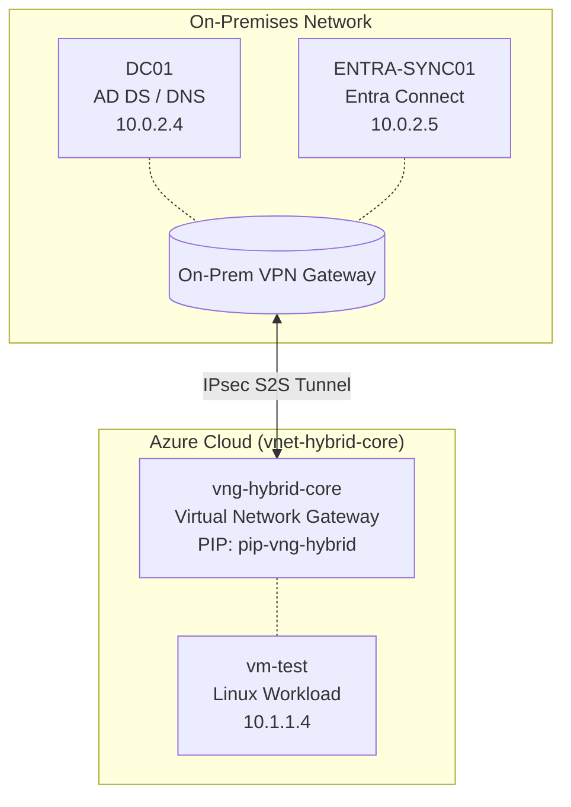

# Azure Hybrid Active Directory Infrastructure Lab

## Overview
This repository contains the architecture and validation evidence for a hybrid Active Directory environment. The infrastructure bridges an on-premises network with an Azure Virtual Network (VNet) via a Site-to-Site (S2S) IPsec VPN tunnel. This enables secure cross-premises DNS resolution, domain-joined workloads, and identity synchronization via Microsoft Entra Connect.

## 1. Architecture & Topology

### Network Diagram

### IP Address Management (IPAM)
| Hostname | Role | IP Address |
| :--- | :--- | :--- |
| **DC01** | Primary Domain Controller & DNS | `10.0.2.4` |
| **ENTRA-SYNC01** | Microsoft Entra Connect Sync Server | `10.0.2.5` |
| **vng-hybrid-core** | Virtual Network Gateway | `pip-vng-hybrid` / `GatewaySubnet` `10.1.255.0/27` |
| **vm-test** | Domain-Joined Workload (Linux) | `10.1.1.4` |

## 2. Evidence Chain of Custody

| Step | Source System | Evidence File / Artifact | Key Findings |
|---|---|---|---|
| **01. S2S Tunnel Establishment** | Azure Portal | [vpn-gateway-status](./vpn-gateway-status.jpg) | Confirmed S2S tunnel connectivity and bi-directional data flow between on-premises and Azure. |
| **02. Layer 3 Routing Validation** | `DC01` | [tracert-to-azure-vm](./tracert-to-azure-vm.txt) | Validated Layer 3 routing across the IPsec tunnel from the on-premises network to the Azure VNet. |
| **03. Remote Access Verification** | Local Workstation | [ssh-session-vm-test](./ssh-session-vm-test.jpg) | Verified remote administrative access to `vm-test` via SSH over the private IPsec tunnel. |
| **04. Cross-Premises DNS Resolution** | `vm-test` | [dig-hybrid-lan](./dig-hybrid-lan.jpg) | Confirmed Azure workload resolution of the local Active Directory domain (`hybrid.lan`) via `DC01`. |
| **05. AD Port Reachability** | `vm-test` | [nc-ad-ports-check](./nc-ad-ports-check.txt) | Proved Network Security Group (NSG) allowances for Active Directory LDAP and Kerberos traffic. |
| **06. Hybrid Domain Integration** | `DC01` (ADUC) | [aduc-vm-test-object](./aduc-vm-test-object.png) | Demonstrated successful hybrid domain join of the Linux workload into the local Active Directory. |
| **07. Identity Sync & Filtering** | `ENTRA-SYNC01` | [SSM-EXPORT.JPG](./SSM-EXPORT.JPG) | Verified object ingestion into the Active Directory Connector Space and demonstrated default Entra Connect OS filtering rules for non-native workloads. |
| **08. Hybrid Device Registration** | Azure Portal | [entra-hybrid-join-status.png](./entra-hybrid-join-status.png) | Verified successful Hybrid Microsoft Entra join and synchronization of a standard Windows production workload to the cloud tenant. |

## 3. Tunnel Health & Layer 3 Routing
*   **Gateway Status:** *(Insert screenshot: Azure Portal showing the VPN Connection status as "Connected" with visible "Data in" and "Data out" metrics)*
*   **Trace Routing:** *(Insert text/screenshot: Output of `tracert 10.1.1.4` from `DC01` showing ICMP packets correctly routing through the on-premises gateway and across the IPsec tunnel)*
*   **SSH Validation:** *(Insert screenshot: Terminal successfully SSH'd into the Linux VM `10.1.1.4` from the local network)*

## 4. Name Resolution & Core Services
Hybrid AD relies entirely on flawless DNS. This validates that the Azure VNet can communicate with the domain controller:

*   **Cross-Premises DNS:** *(Insert text/screenshot: Output of `dig @10.0.2.4 hybrid.lan +short` from the Linux VM)*
*   **Port Validation:** *(Insert text: Output of `nc -zv 10.0.2.4 389` (LDAP) and `nc -zv 10.0.2.4 88` (Kerberos) from the Linux VM proving NSGs and firewalls allow AD traffic)*

## 5. Domain Integration
This serves as the ultimate proof of the hybrid connection working:

*   **Active Directory Computer Object:** *(Insert screenshot: Active Directory Users and Computers (ADUC) on `DC01` showing the `vm-test` computer object populated in the correct Organizational Unit)*
*   **Entra Connect Sync:** *(Insert CSV/screenshot: Synchronization Service Manager on `ENTRA-SYNC01` showing a successful "Export" operation to Azure AD)*

---
**Troubleshooting Notes:** 
*   **Bastion Bypass:** During initial configuration, the Azure Bastion Developer SKU experienced a regional DNS resolution failure (`NODATA` response from Traffic Manager). Management operations were successfully rerouted through the Site-to-Site VPN as an out-of-band management fallback.
