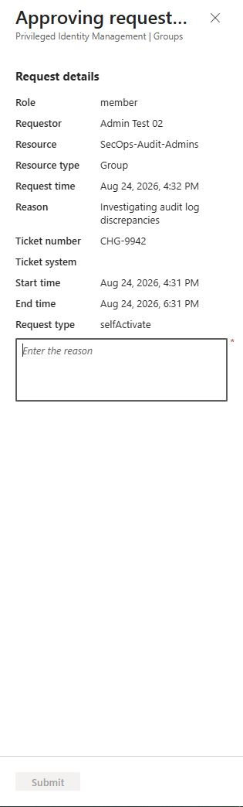
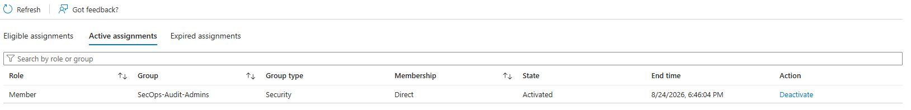

# Privileged Identity Management (PIM): Just-In-Time (JIT) Elevation

## Executive Summary
This directory contains evidence validating the enforcement of Zero Trust principles by stripping standing administrative access and implementing Just-In-Time (JIT) elevation. Using Microsoft Entra Privileged Identity Management (PIM) for Groups, temporary dual-plane access (Entra ID & Azure ARM) is granted only after a documented request and manual management approval.

---

## 1. Test Metadata
* **Target Security Group:** `SecOps-Audit-Admins`
* **Test Subject Account:** `Admin Test 02`
* **Elevation Mechanism:** PIM for Groups
* **Maximum Activation Window:** 2 Hours
* **Constraints:** Justification Required, Ticket Number Required, Manual Approval Required

---

## 2. Evidence Chain of Custody

| Step | Phase | Evidence File / Artifact | Key Findings |
|---|---|---|---|
| **1. Request Initiation** | PIM Portal | [acitvate-request](./pim-activate-request.jpg) | User requested activation linking mock ticket `CHG-9942` with justification. |
| **2. Manual Approval** | PIM Portal | [request-approval](./pim-approval-request.jpg) | Global Admin evaluated and approved the request for the specified ticket execution. |
| **3. Time-Bound Execution** | PIM Portal | [active-assignment](./pim-active-timebound.jpg) | Access granted with a hard cryptographic expiration timestamp exactly two hours from activation. |
| **4. Automated Revocation** | Entra Audit Logs | [pim-auto-revoke.jpg](./pim-auto-revoke.jpg) | System automatically stripped group membership precisely at the two-hour expiration mark. |

---

## 3. Deep-Dive Analysis: Architecture & PIM for Groups

### Standing Access Remediation
To adhere strictly to Zero Trust, permanent administrative access was removed. The target user operates as a standard, unprivileged identity during day-to-day operations. Access to the `SecOps-Audit-Admins` group is entirely governed by PIM eligibility policies, neutralizing the blast radius of a potential credential compromise.

### PIM for Groups vs. Direct Role Assignment
Rather than managing distinct PIM eligibilities for the Entra ID Directory Role (`Global Reader`) and the Azure Resource Role (`Reader`), **PIM for Groups** was utilized. 
* **Scalability:** The group acts as a centralized payload for Role-Based Access Control (RBAC). 
* **Workflow:** A single JIT approval workflow temporarily injects the user into the group, allowing them to simultaneously inherit both Identity-plane and Resource-plane permissions for the duration of the time-bound window.

---

## 4. Artifacts

### Visual Evidence

#### 1. JIT Request & Approval Workflow

#### 2. Time-Bound Active Assignment

