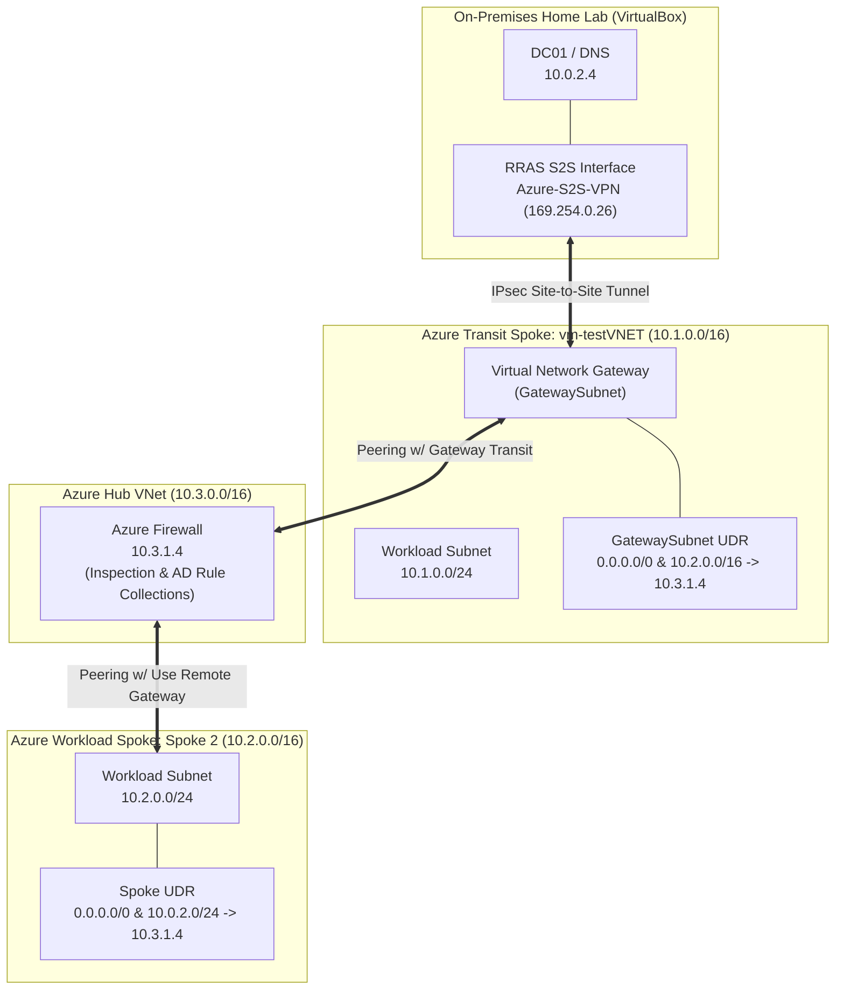

# Hybrid Network Architecture & Centralized Firewall Routing Validation

## Executive Summary
This directory contains end-to-end evidence validating the deployment, asymmetric route remediation, and stateful security enforcement of a production-grade hybrid cloud landing zone. Rather than relying on direct VNet peering shortcuts, all cross-spoke and hybrid transit traffic is routed through a centralized Azure Firewall NVA, bridging on-premises Active Directory (`DC01`) to Azure spoke workloads over an encrypted IPsec Site-to-Site VPN.

---

## 1. Environment & Architecture Metadata
* **On-Premises Hypervisor:** VirtualBox hosting `DC01` (`10.0.2.4`)
* **Tunnel Interface:** Windows Server RRAS IPsec S2S (`Azure-S2S-VPN`)
* **Transit Spoke VNet:** `vm-testVNET` (`10.1.0.0/16`) hosting the Virtual Network Gateway (`GatewaySubnet`)
* **Central Hub VNet:** Hub (`10.3.0.0/16`) hosting Azure Firewall (`10.3.1.4`)
* **Workload Spoke VNet:** Spoke 2 (`10.2.0.0/16`)

---

## 2. Network Topology

---

## 3. Evidence Chain of Custody

| Step | Source System | Evidence File / Artifact | Key Findings |
|---|---|---|---|
| **1. Tunnel Binding** | `DC01` | [route-print](./route-print.txt) | Persistent routes for `10.1.0.0/16` and `10.2.0.0/16` bound to interface `26` (`169.254.0.26`) |
| **2. Gateway Transit** | `vm-testVNET` | [portal-vng-peering](./portal-vng-peering.jpg) | Gateway Transit enabled on peering toward Hub; `GatewaySubnet` UDR routes to Firewall |
| **3. Firewall Policy** | Azure Firewall | [azfw-rule-collection](./azfw-rule-collection.jpg) | `DefaultNetworkRuleCollectionGroup` configured with `RC-Active-Directory-Sync` (Priority `200`) |
| **4. Port Reachability** | Spoke 2 VM | [spoke2-nc-validation](./spoke2-nc-validation.jpg) | `nc -zv 10.0.2.4 <port>` returns open/connected across all required directory service ports |
| **5. Packet Inspection** | Log Analytics | [azfw-network-rule-log](./azfw-network-rule-log) | `AZFWNetworkRule` logs `Action: Allow` on rule `RC-Active-Directory-Sync` for transit flows |

---

## 4. Deep-Dive Analysis: Routing & Security Mechanics

### Asymmetric Path Mitigation & Host Route Injection
To enable communication between the on-premises virtual environment and Azure spokes without dropping packets at the stateful firewall plane:
* **Host Routing:** The Windows host kernel requires explicit persistent routes (`route -p add`) mapping both `10.1.0.0/16` and `10.2.0.0/16` to the APIPA tunnel interface (`169.254.0.26`) to prevent packets from routing to the default gateway[cite: 1].
* **Gateway Subnet UDR:** A custom route table applied to `GatewaySubnet` forces all ingress cross-premises traffic destined for Spoke 2 (`10.2.0.0/16`) directly to the Azure Firewall (`10.3.1.4`) before reaching workload subnets.
* **Return Path Integrity:** Spoke subnets utilize a UDR routing `10.0.2.0/24` to the Azure Firewall private IP, ensuring both ingress and egress passes traverse the stateful engine symmetrically.

### Stateful Identity Traffic Inspection (`RC-Active-Directory-Sync`)
Instead of allowing uninspected network traversal, domain services are explicitly filtered and governed through stateful network rules:
* **Directory Services:** TCP/UDP `389` (LDAP), `636` (LDAPS), and `135` (RPC Endpoint Mapper).
* **Authentication & Names:** TCP/UDP `88` (Kerberos) and `53` (DNS).
* **File & Policy Transport:** TCP `445` (SMB).
* Azure Firewall maintains connection tracking tables, verifying bidirectional session state across the Hub boundary while logging every individual transit packet to Azure Log Analytics.
