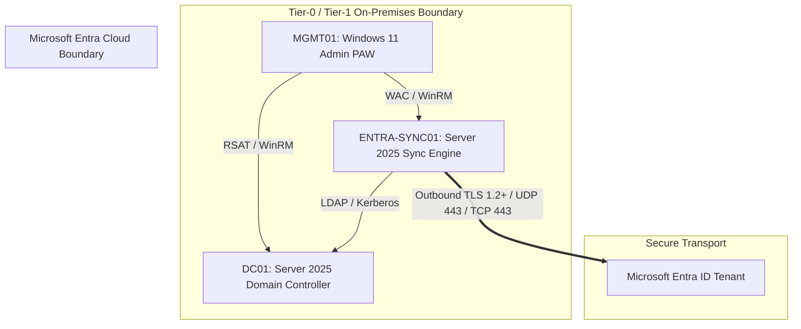

# Enterprise Hybrid Identity PoC: Windows Server 2025 to Microsoft Entra ID

> **Architectural Overview:** Design, deployment, and security hardening of an enterprise hybrid identity infrastructure. This project demonstrates a zero-trust bridge connecting an on-premises **Windows Server 2025 AD DS forest** to a **Microsoft Entra ID tenant** utilizing a dedicated, hardened **Entra Connect Sync** instance.

---

## Technical Stack & Lab Specs

| Domain Component | Technology / Platform | Configuration Baseline |
| :--- | :--- | :--- |
| **Domain Controller (`DC01`)** | Windows Server 2025 | 2025 Functional Level, gMSA Host, Protected Users Group |
| **Sync Host (`ENTRA-SYNC01`)** | Windows Server 2025 | Dedicated Member Server, Application-Based Auth (ABA), TLS 1.2+ |
| **Admin Jump Host (`MGMT01`)** | Windows 11 Enterprise | RSAT, Windows Admin Center, PowerShell 7.4, Git |
| **Identity Service** | Entra Connect Sync v2.x | Password Hash Sync (PHS), SSPR Password Writeback, Seamless SSO |

---

## Network & System Architecture

---

## Evidence

* [Module 01: Self-Service Password Reset (SSPR) & Password Writeback Validation](./Evidence/01-Self-Service-Password-Reset)
* [Module 02: Password Hash Synchronization (PHS) Validation](./Evidence/02-Password-Hash-Synchronization)
* [Module 03: Delta Synchronization & Attribute Lifecycle Validation](./Evidence/03-Delta-Synchronization)
* [Module 04: Account Disable & Identity Deprovisioning Lifecycle](./Evidence/04-Account-Deprovisioning)
