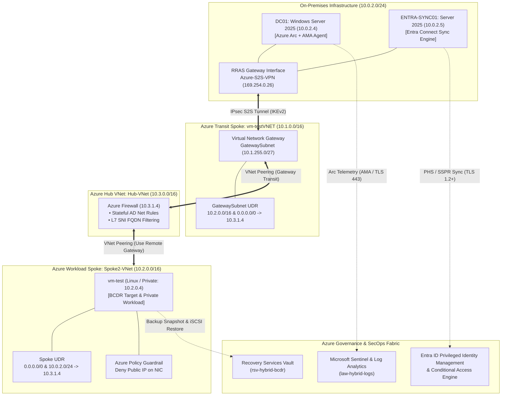

# Enterprise Hybrid Cloud, Security Operations & Landing Zone Architecture

> **Architectural Overview:** Design, deployment, security hardening, and operational validation of an enterprise hybrid cloud landing zone. This infrastructure bridges an on-premises **Windows Server 2025 Tier-0 environment** to **Microsoft Entra ID** and **Microsoft Azure IaaS** via route-based IPsec VPN, enforcing centralized Layer-4/7 firewall inspection, Azure Arc telemetry pipelines, Sentinel SIEM detection, Just-In-Time identity governance, policy-as-code guardrails, and cryptographic BCDR recovery.

---

## Technical Stack & Infrastructure Specifications

| Domain / Plane | Platform / Technology | Architectural Baseline & Security Controls |
| :--- | :--- | :--- |
| **Tier-0 Identity Source** | Windows Server 2025 AD DS | `hybrid.lan` domain, dedicated sync delegation (`svc-entrasync`), isolated OUs. |
| **Hybrid Identity Engine** | Entra Connect Sync v2.x | Password Hash Sync (PHS), SSPR Password Writeback, TLS 1.2+ transport. |
| **Hybrid Transit Networking** | Route-Based IPsec VPN (IKEv2) | APIPA Point-to-Point tunnel (`169.254.0.26`), Gateway Transit peering. |
| **Perimeter & Traffic Inspection**| Azure Firewall Standard | Forced UDR egress (`0.0.0.0/0 -> 10.3.1.4`), stateful AD rules, L7 SNI FQDN filtering. |
| **SecOps & Hybrid Monitoring** | Azure Arc & Microsoft Sentinel | Azure Monitor Agent (AMA), Windows Security Event streaming, scheduled KQL rules. |
| **Access Governance & Privileges**| Entra PIM & Conditional Access | JIT elevation for groups, time-bound auto-revocation, MFA authentication strength. |
| **Landing Zone Guardrails** | Azure Policy (Policy-as-Code) | ARM control-plane pre-flight deny on public IP attachment to NICs. |
| **Disaster Recovery (BCDR)** | Recovery Services Vault (RSV) | App-consistent snapshots, iSCSI item-level recovery, SHA-256 hash validation. |

---

## Master Architecture Topology

---

## Evidence Directory & Validation Modules

### 1. Hybrid Identity & Directory Lifecycle
* **[Module 01: Self-Service Password Reset (SSPR) & Writeback](./Evidence/01-Self-Service-Password-Reset/)**  
  Validates cloud-initiated SSPR triggering on-premises Active Directory password updates via secure writeback pipelines.
* **[Module 02: Password Hash Synchronization (PHS)](./Evidence/02-Password-Hash-Synchronization/)**  
  Validates real-time HMAC-SHA256 password hash extraction, sync diagnostics, and automated cloud credential ingestion.
* **[Module 03: Delta Synchronization & Attribute Scoping](./Evidence/03-Delta-Synchronization/)**  
  Proves granular object modification tracking across Connector Space, Metaverse transforms, and tenant schema updates.
* **[Module 04: Account Deprovisioning & Disable Lifecycle](./Evidence/04-Account-Deprovisioning/)**  
  Demonstrates on-premises `userAccountControl` bitmask flags (514) triggering cloud account suspension and CAE token revocation.

### 2. Hybrid Operations & Threat Monitoring
* **[Module 05: Azure Arc Hybrid Infrastructure Management](./Evidence/05-Arc-Agent/)**  
  Projects on-premises Domain Controllers into ARM via `azcmagent`, establishing AMA telemetry pipelines and runtime recovery runbooks.
* **[Module 06: Microsoft Sentinel SIEM & Threat Detection](./Evidence/06-Sentinel/)**  
  Validates automated incident triage and detection of simulated privilege escalation attacks across hybrid directory logs.

### 3. Hybrid Networking & Perimeter Hardening
* **[Module 07: Site-to-Site IPsec VPN Transit & Hybrid Join](./Evidence/07-S2S-VPN/)**  
  Establishes cross-premises route-based tunnel routing, bidirectional DNS lookups, Linux domain integration, and Windows Hybrid Entra Join.
* **[Module 10: Centralized Hub-and-Spoke Firewall Routing](./Evidence/10-HS-Firewall/)**  
  Eliminates asymmetric routing via UDR next-hop interception, enforcing stateful Active Directory filtering and Layer-7 SNI FQDN egress rules.

### 4. Zero-Trust Access Control & Cloud Governance
* **[Module 08: Zero-Trust Administrative Conditional Access](./Evidence/08-Conditional-Access/)**  
  Enforces Authentication Strength requirements across dual-plane RBAC roles (`Global Reader` / `Reader`) with break-glass safety exclusions.
* **[Module 09: Just-In-Time (JIT) Privileged Identity Management](./Evidence/09-JIT-PIM/)**  
  Eliminates standing privileges by implementing ticket-justified, approved, time-bound role activations and automated revocation.
* **[Module 11: Enterprise Landing Zone Guardrails via Azure Policy](./Evidence/11-Azure-Policy/)**  
  Deploys custom preventative Policy-as-Code definitions that deterministically block public IP attachment to spoke compute interfaces.

### 5. Business Continuity & Disaster Recovery (BCDR)
* **[Module 12: Hybrid Business Continuity via Azure Backup](./Evidence/12-BCDR-Backup/)**  
  Validates filesystem-consistent snapshot orchestration, iSCSI item-level file restoration, and SHA-256 cryptographic payload integrity.

---

## Architectural Documentation & Automation Assets

* **[Architecture Design Record (ADR-001)](./Docs/Architecture-Design-Record.md):** Formal engineering decision log detailing constraints, tradeoffs, and production baselines.
* **[Network Matrix & Hardening Guide](./Docs/Network-Matrix-and-Hardening.md):** Comprehensive port matrix, routing rules, and crypto configuration.
* **[Security & Identity Controls Matrix](./Docs/Security-and-Identity-Controls.md):** Mapping of administrative controls, ACL delegations, and audit configurations.
* **[Automation Scripts (`/Scripts/`)](./Scripts/):** Reusable PowerShell deployment tooling for transport hardening and identity bootstrapping.
* **[Operational Runbooks (`/Runbooks/`)](./Runbooks/):** Standard operating procedures for synchronization management, diagnostic tracing, and failover.
